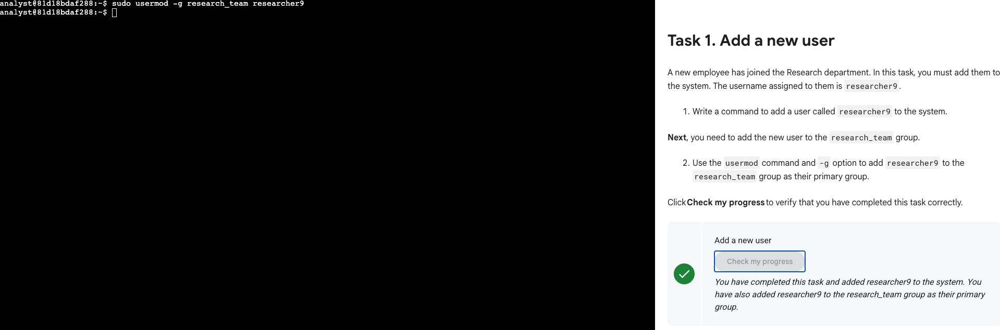
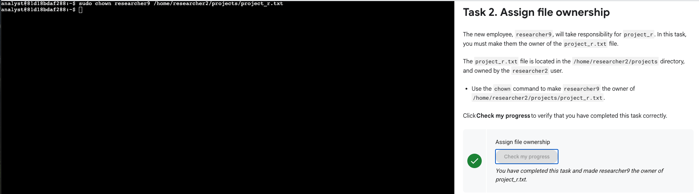
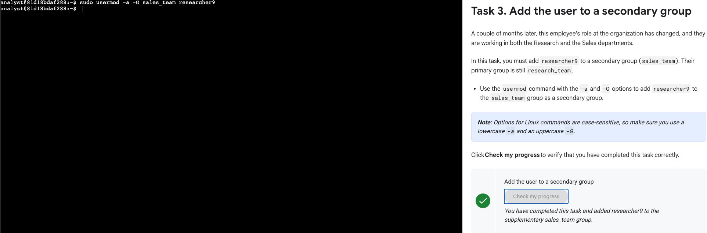
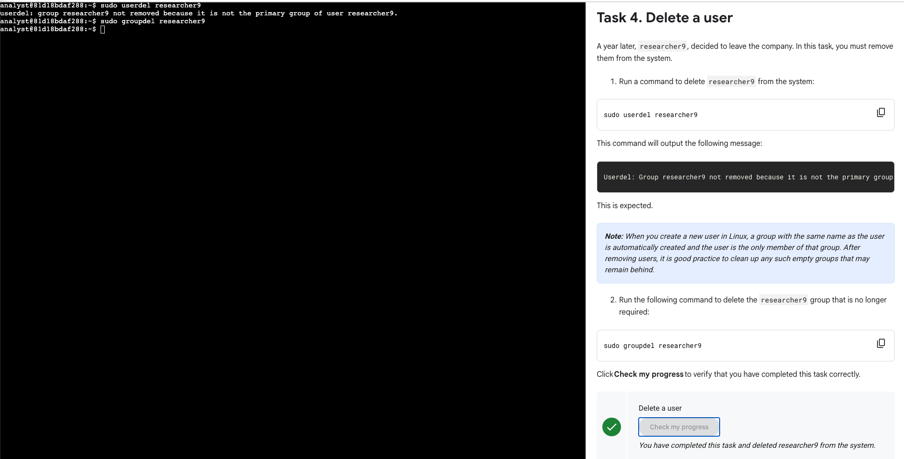

# Adding and Managing Users in Linux  
*Google Cybersecurity Certificate – Course 03: Tools of the Trade: Linux and SQL*  
*(Portfolio Activity – User and Group Management)*  

---

## 🎯 Lab Summary  
This lab focused on practicing **user and group management in Linux**, a critical part of system administration and security.  

The following tasks were performed:  
- Add a new user to the system  
- Assign file ownership to the new user  
- Add the user to a secondary group  
- Remove the user and associated group  

These exercises reinforced **Linux account management** skills, ensuring proper access control and strengthening authentication practices.  

---

## ⚙️ Steps and Commands  

### 1️⃣ Add a new user  
Commands executed:  
```bash
sudo useradd researcher9
sudo usermod -g research_team researcher9
```  
- Created a new user `researcher9`.  
- Assigned them to the primary group `research_team`.  

📸  


---

### 2️⃣ Assign file ownership  
Commands executed:  
```bash
sudo chown researcher9 /home/researcher2/projects/project_r.txt
```  
- Changed ownership of `project_r.txt` so `researcher9` is the file owner.  

📸  


---

### 3️⃣ Add the user to a secondary group  
Commands executed:  
```bash
sudo usermod -a -G sales_team researcher9
```  
- Added `researcher9` to the `sales_team` group as a **secondary group**.  

📸  


---

### 4️⃣ Delete a user  
Commands executed:  
```bash
sudo userdel researcher9
sudo groupdel researcher9
```  
- Removed the user `researcher9` from the system.  
- Deleted the associated group `researcher9` that was automatically created.  

📸  


---

## 🧠 Reflections / Notes  
- Practiced **adding and removing users** in Linux.  
- Managed **primary and secondary groups** to control access.  
- Reassigned **file ownership** to reflect changes in responsibility.  
- Learned how to properly clean up users and groups to avoid leftover security risks.  

---

## 📚 Key Skills Demonstrated  
- Linux **user management with `sudo`** (`useradd`, `usermod`, `userdel`)  
- **Group management** (`usermod -g`, `usermod -a -G`, `groupdel`)  
- Assigning **file ownership** with `chown`  
- Understanding primary vs. secondary groups  
- Applying **principle of least privilege** in Linux environments  
- **UNIX terminal workflow** and Git documentation practices  

---

*This activity demonstrates the ability to securely add, manage, and remove users in Linux, ensuring proper access control and system security.*  

