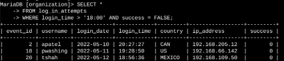

# Applying Filters to SQL Queries  
*Google Cybersecurity Certificate – Course 03: Tools of the Trade: Linux and SQL*  
*(Portfolio Activity – SQL Filtering & Data Analysis)*  

---

## 🎯 Lab Summary  
In this lab, I practiced applying filters to SQL queries to investigate potential **security incidents** and to identify **employees requiring system updates**.  

The following tasks were performed:  
- Retrieve failed login attempts after business hours  
- Retrieve login attempts on specific dates  
- Retrieve login attempts outside of Mexico  
- Retrieve employees in the Marketing department (East building)  
- Retrieve employees in Finance or Sales departments  
- Retrieve employees not in the IT department  

These exercises strengthened my ability to use **WHERE clauses with AND, OR, NOT, and LIKE operators** to extract relevant data from system logs and employee records.  

---

## ⚙️ Steps and Commands  

### 1️⃣ Retrieve after-hours failed login attempts  
```sql
SELECT * 
FROM log_in_attempts 
WHERE login_time > '18:00' AND success = FALSE;
```  
- Filtered all failed login attempts that occurred after 18:00.  

📸  


---

### 2️⃣ Retrieve login attempts on specific dates  
```sql
SELECT * 
FROM log_in_attempts 
WHERE login_date = '2022-05-09' OR login_date = '2022-05-08';
```  
- Returned all login attempts from **2022-05-09** and the day before (**2022-05-08**).  

📸  


---

### 3️⃣ Retrieve login attempts outside of Mexico  
```sql
SELECT * 
FROM log_in_attempts 
WHERE NOT country LIKE 'MEX%';
```  
- Returned all login attempts in countries other than Mexico (`MEX`, `MEXICO`).  

📸  


---

### 4️⃣ Retrieve employees in Marketing (East building)  
```sql
SELECT * 
FROM employees 
WHERE department = 'Marketing' AND office LIKE 'East%';
```  
- Returned employees in the **Marketing department** working in the **East building**.  

📸  


---

### 5️⃣ Retrieve employees in Finance or Sales  
```sql
SELECT * 
FROM employees 
WHERE department = 'Finance' OR department = 'Sales';
```  
- Returned employees from the **Finance** or **Sales** departments.  

📸  


---

### 6️⃣ Retrieve all employees not in IT  
```sql
SELECT * 
FROM employees 
WHERE NOT department = 'Information Technology';
```  
- Returned all employees **not in the IT department**.  

📸  


---

## 🧠 Reflections / Notes  
- Learned how to filter SQL query results using **AND, OR, and NOT** operators.  
- Applied `LIKE` and the `%` wildcard to search for text patterns.  
- Practiced combining multiple conditions to investigate security incidents.  
- Retrieved specific employee subsets to plan targeted system updates.  

---

## 📚 Key Skills Demonstrated  
- SQL data filtering with **WHERE**  
- Use of **AND, OR, NOT operators**  
- Pattern matching with **LIKE** and `%`  
- Log analysis with SQL queries  
- Employee dataset filtering for system updates  
- **Git and UNIX commands** for workflow documentation  

---

*This activity demonstrates the ability to apply SQL filters for investigating login attempts and retrieving targeted employee data, supporting both security monitoring and system administration tasks.*  

