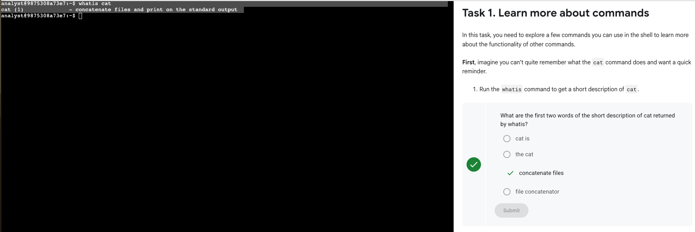
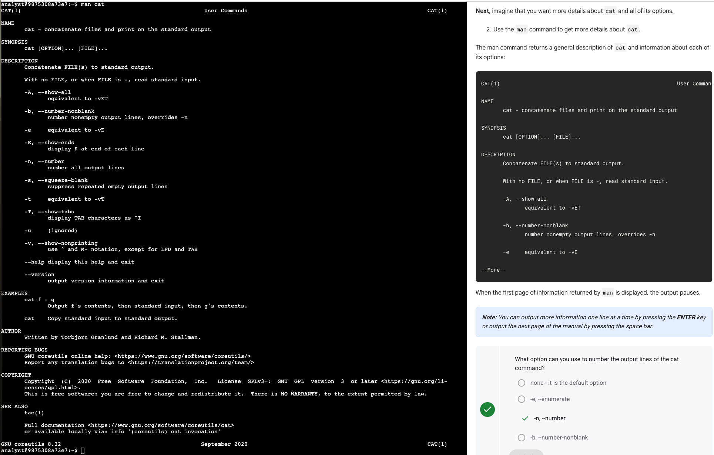
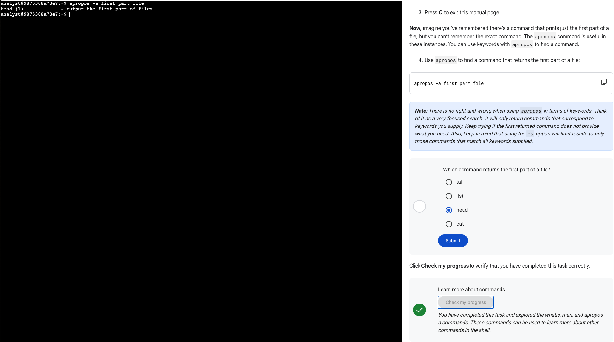
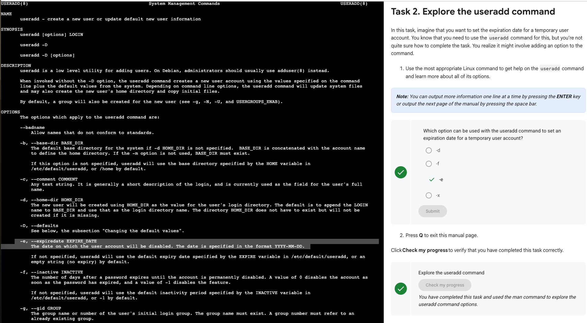
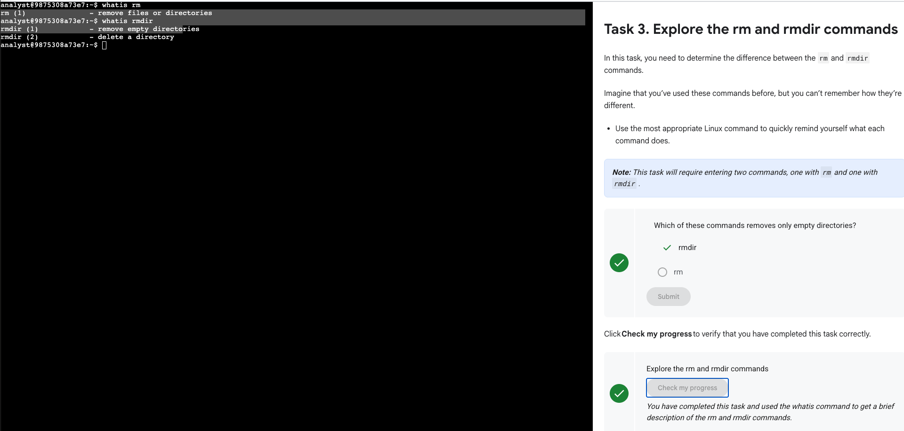
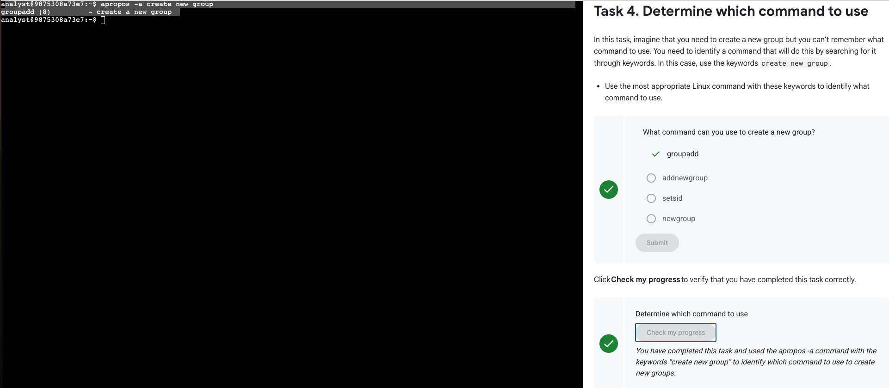

# Getting Help in the Linux Command Line  
*Google Cybersecurity Certificate – Course 03: Tools of the Trade: Linux and SQL*  
*(Portfolio Activity – Command Documentation & Help Utilities)*  

---

## 🎯 Lab Summary  
This lab focused on using Linux help utilities to quickly discover what commands do and how to use them:
- `whatis` for short descriptions
- `man` for full manuals and options
- `apropos` to find commands by keywords
- Distinguishing similar commands (`rm` vs `rmdir`)
- Identifying the correct command to create a new group

---

## ⚙️ Steps and Commands  

1️⃣ ### Task 1 — Learn more about commands (3 subtasks)

**1.1 Quick description with `whatis`**  
```bash
whatis cat
```  
Returned: *“concatenate files and print on the standard output.”*

📸  


**1.2 Explore full manual with `man`**  
```bash
man cat
```  
Reviewed useful options:
- `-n` — number all output lines  
- `-b` — number non-empty output lines  

📸  


**1.3 Find a command by purpose with `apropos`**  
```bash
apropos -a "first part file"
```  
Identified **`head`** → *“output the first part of files”*.

📸  


---

2️⃣ ### Task 2 — Explore the `useradd` command
```bash
man useradd
```  
Confirmed the option **`-e`** to set an **expiration date** for temporary user accounts.

📸  


---

3️⃣ ### Task 3 — Compare `rm` vs `rmdir`
```bash
whatis rm
whatis rmdir
```  
- `rm` → remove files or directories  
- `rmdir` → remove **empty** directories only

📸  


---

4️⃣ ### Task 4 — Determine which command to use (create a new group)
```bash
apropos -a "create new group"
```  
Found the correct command: **`groupadd`**.

📸  


---

## 🧠 Reflections / Notes  
- `whatis` provides instant, one-line reminders of a command’s purpose.  
- `man` is the authoritative source for syntax and options; learning to skim it fast is key.  
- `apropos` is perfect when you know *what* you want to do but not *which* command does it.  
- Differentiating `rm` and `rmdir` prevents destructive mistakes when handling directories.  

---

## 📚 Key Skills Demonstrated  
- Proficient use of `man`, `whatis`, and `apropos`  
- Discovering command options and correct syntax  
- Selecting the right command by keyword search  
- Confident, self-directed troubleshooting in the Linux terminal  

---

*This activity demonstrates the ability to independently find and understand Linux commands using built-in help utilities—an essential skill for cybersecurity and system administration.*

