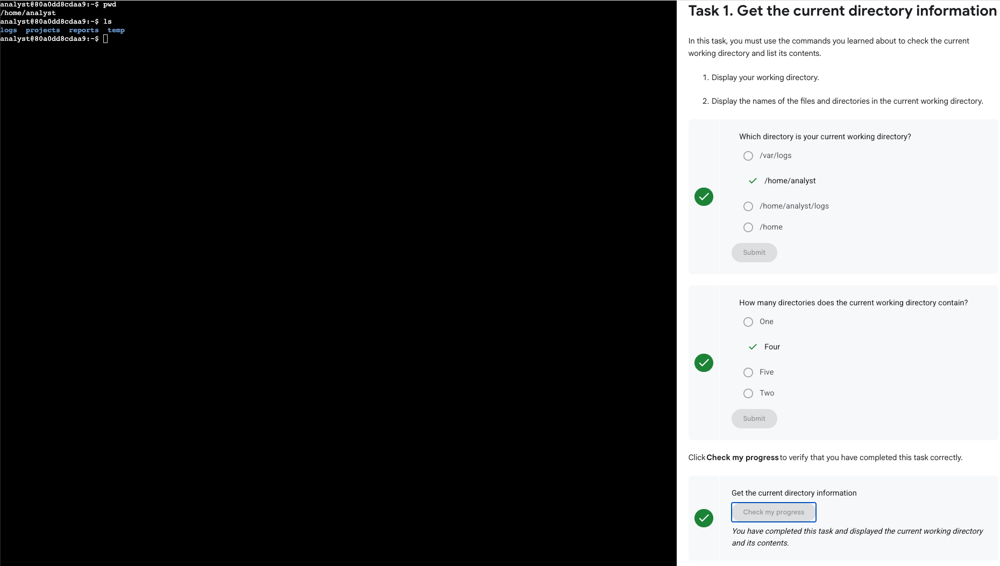
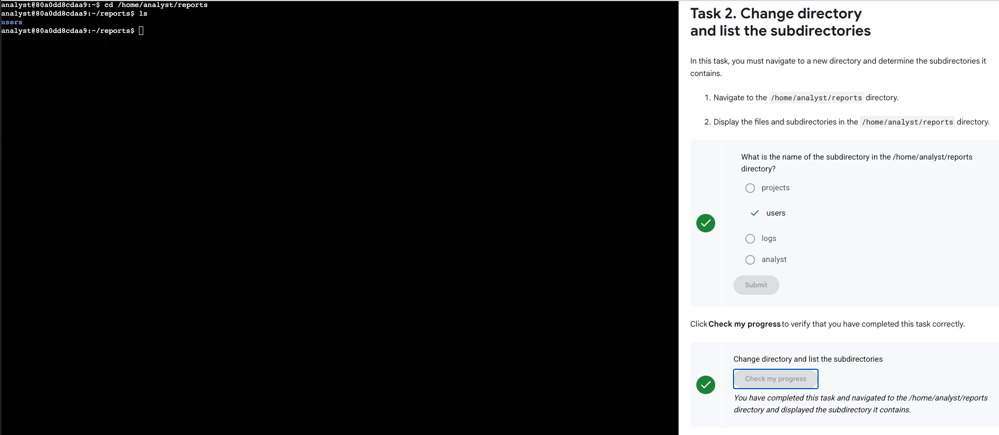
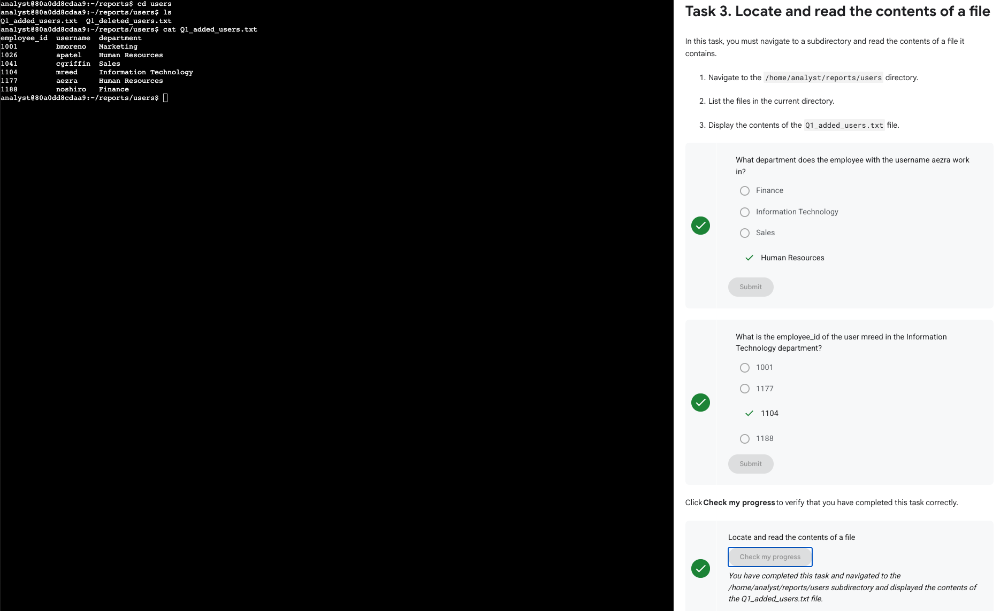
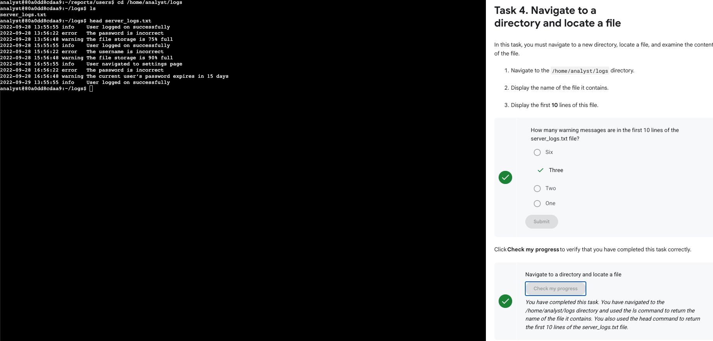
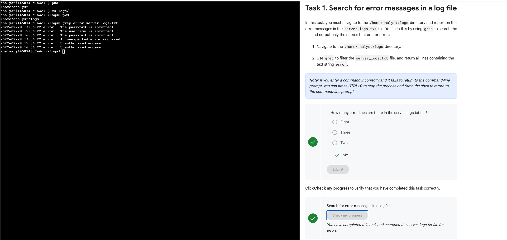
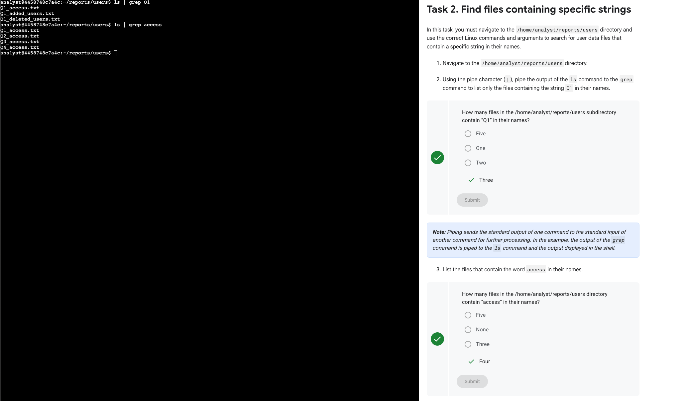
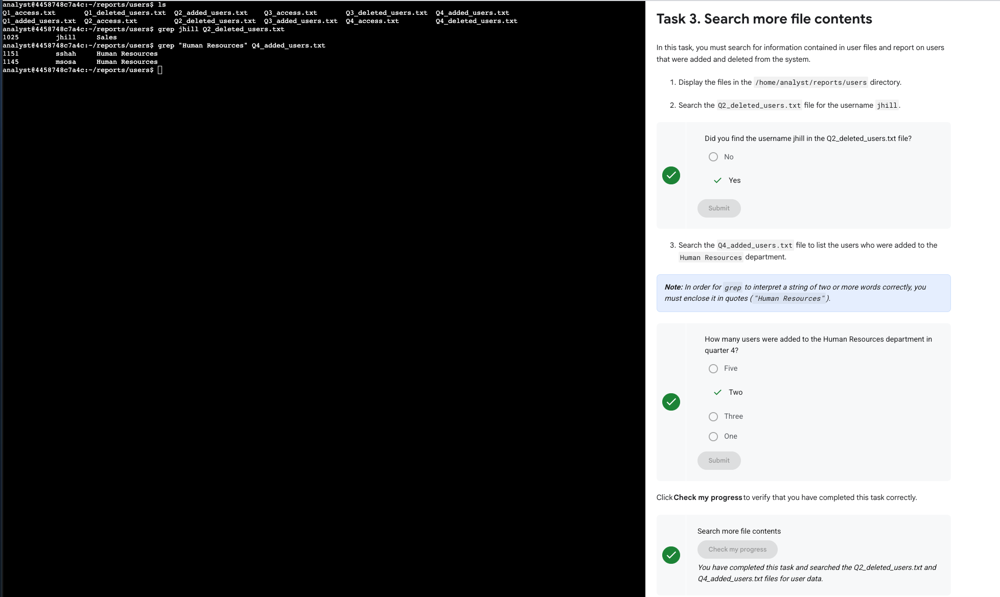

# Navigating and Searching Files in Linux with Basic Commands and Grep  
*Google Cybersecurity Certificate – Course 03: Tools of the Trade: Linux and SQL*  
*(Portfolio Activity – Linux File Management & Filtering)*  

---

## 🎯 Lab Summary  
This combined lab focused on two key areas of Linux command-line practice:  

1. **Navigating and managing files/directories** with basic UNIX commands.  
2. **Filtering and searching file content** using the `grep` command and pipes (`|`).  

The following tasks were performed:  
- Display current directory and list contents  
- Navigate into directories and list subdirectories  
- Locate and read contents of text files  
- Display the first 10 lines of a log file  
- Search for error messages in logs with `grep`  
- Use pipes to filter files containing specific strings  
- Search file contents for specific usernames and departments  

These exercises reinforced **Linux system navigation** and **text processing skills** essential for log analysis and cybersecurity investigations.  

---

## ⚙️ Steps and Commands  

### 1️⃣ Get the current directory information  
Commands executed:  
```bash
pwd
ls
```  
- Displayed the current working directory: `/home/analyst`  
- Listed its contents: `logs projects reports temp`  

📸


---

### 2️⃣ Change directory and list subdirectories  
Commands executed:  
```bash
cd /home/analyst/reports
ls
```  
- Navigated to `/home/analyst/reports`  
- Listed subdirectories → found `users`  

📸


---

### 3️⃣ Locate and read the contents of a file  
Commands executed:  
```bash
cd users
ls
cat Q1_added_users.txt
```  
- Displayed employees and departments.  
- Found that `aezra` works in **Human Resources**.  
- Confirmed employee ID of `mreed` in IT department → `1104`.  

📸


---

### 4️⃣ Navigate to a directory and locate a file  
Commands executed:  
```bash
cd /home/analyst/logs
ls
head server_logs.txt
```  
- Displayed the first 10 lines of `server_logs.txt`.  
- Identified **3 warning messages** in those lines.  

📸


---

### 5️⃣ Search for error messages in a log file  
Commands executed:  
```bash
cd /home/analyst/logs
grep error server_logs.txt
```  
- Used `grep` to filter only error messages.  
- Found **6 error entries**.  

📸


---

### 6️⃣ Find files containing specific strings  
Commands executed:  
```bash
cd /home/analyst/reports/users
ls | grep Q1
ls | grep access
```  
- Found **3 files** containing `Q1` in their names.  
- Found **4 files** containing `access` in their names.  

📸


---

### 7️⃣ Search more file contents  
Commands executed:  
```bash
grep jhill Q2_deleted_users.txt
grep "Human Resources" Q4_added_users.txt
```  
- Verified that username `jhill` was in `Q2_deleted_users.txt`.  
- Found **2 users** added to Human Resources in Q4.  

📸


---

## 🧠 Reflections / Notes  
- Practiced core **Linux navigation commands** (`pwd`, `ls`, `cd`, `cat`, `head`).  
- Strengthened use of **grep** and **pipes** for filtering data.  
- Applied commands to **log analysis**, a common cybersecurity task.  
- Learned to extract **specific insights** from structured text files (e.g., errors, usernames, departments).  

---

## 📚 Key Skills Demonstrated
- **Git and UNIX commands** for .md file management and workflow  
- Linux filesystem navigation (`pwd`, `ls`, `cd`)  
- File content inspection (`cat`, `head`)  
- Text searching with **grep**  
- Using **pipes** (`|`) to filter command output  
- Log analysis and user data extraction  
- **UNIX terminal workflow** and Git documentation practices  

---

*This combined activity demonstrates the ability to navigate Linux file systems, read and filter file contents, and apply grep for log analysis in a cybersecurity context.*

