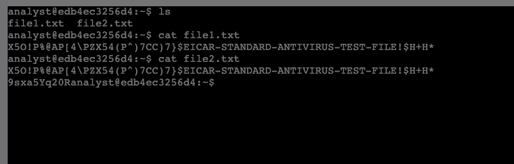
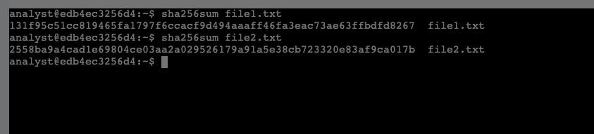
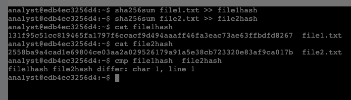

# Verifying File Integrity in Linux with SHA-256 Hash Values  
*Google Cybersecurity Certificate – Course 04: Assets, Threats, and Vulnerabilities*  
*(Portfolio Activity – Create and Compare Hash Values)*  

---

## 🎯 Lab Summary  

In this activity, I practiced using SHA-256 hashing in Linux to verify file integrity.  
Two files contained what appeared to be the same content, but hashing revealed differences that were not visible through manual inspection.  

The main objectives were to:  

- Work with two files that looked similar but were not identical  
- Generate SHA-256 hash values for each file  
- Compare the hash outputs to detect differences that are not obvious to the naked eye  
- Understand how hashing supports malware analysis, digital forensics, and integrity monitoring  

This lab demonstrates how hash functions reveal subtle differences and ensure file integrity.

---

## ⚙️ Steps and Commands  

### 1️⃣ Inspect the files and their contents  

Commands executed:

    ls
    cat file1.txt
    cat file2.txt

- Verified that both files (`file1.txt` and `file2.txt`) existed  
- Viewed their contents  
- Confirmed that both files contained the **EICAR antivirus test string**  

📸  

---

### 2️⃣ Generate SHA-256 hash values  

Commands executed:

    sha256sum file1.txt >> file1hash
    sha256sum file2.txt >> file2hash
    cat file1hash
    cat file2hash

- Generated a separate **SHA-256 hash** for each file  
- Observed that the resulting hash values were **different**, indicating a difference between the files even though their visible contents appeared very similar  

📸  

---

### 3️⃣ Compare the hash values  

Command executed:

    cmp file1hash file2hash

Output:

    file1hash file2hash differ: char 1, line 1

- Used `cmp` to compare the two hash files line by line  
- The output confirmed that the two files are **NOT identical**, even though they both display the same EICAR test string when viewed with `cat`  

📸  

---

## 🧠 Reflections / Notes  

- Hash values provide a **reliable, tamper-evident method** to verify file integrity  
- Even a tiny, non-visible change (for example whitespace or control characters) produces a **completely different** SHA-256 hash  
- Hashing is essential in:  
  - **Digital forensics** – verifying that evidence has not been altered  
  - **Malware analysis** – identifying known malicious files by their hash  
  - **Chain-of-custody documentation** – proving files remained unchanged  
  - **Integrity monitoring** – checking critical system files for unauthorized modification  
- This lab reinforced how hashing can be integrated into security workflows to detect subtle changes that normal visual inspection would miss  

---

## 📚 Key Skills Demonstrated  

- Using **SHA-256 hashing** with `sha256sum` in Linux  
- Validating file integrity by generating and comparing hash values  
- Using `cmp` to compare hash outputs  
- Applying hashing concepts to **cybersecurity** and **digital forensics** use cases  
- Strengthening confidence with the Linux command line and basic integrity-check workflows  

---

*This activity demonstrates practical file integrity verification using cryptographic hashes — a foundational skill in cybersecurity.*

